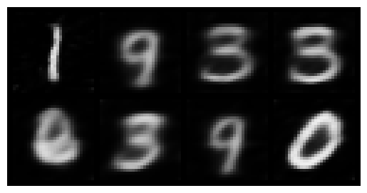

# Hypernetwork-VAE-to-SIREN-Generator
Repo containing work into building a Hypernetwork VAE that learns the weights of a SIREN which then produces images. Learns function space instead of image.

The hypernetwork is trained in an end to end way. The weights output by the VAE are used to build the SIREN and the SIREN in turn produces an image. MSE, SSIM, and KL Divergence for the VAE are used to train the hypernetwork, whereas the SIREN needs no training. 

Results from an MNIST trial are below. The results are after 2 epochs of training, and they are blurry as expected with L2/L1 reconstruction error. I'm hoping it'll improve with more training, SSIM, and the SIRENs high frequency capturing capability.

